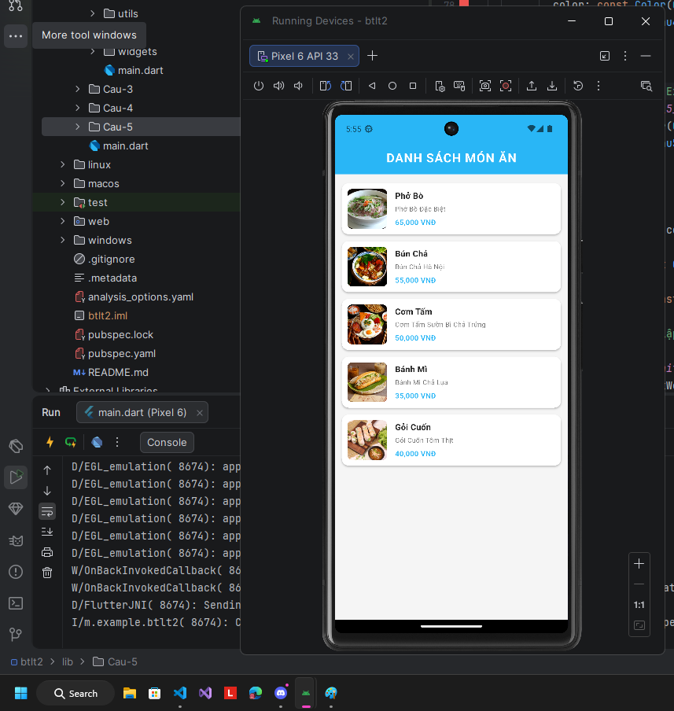
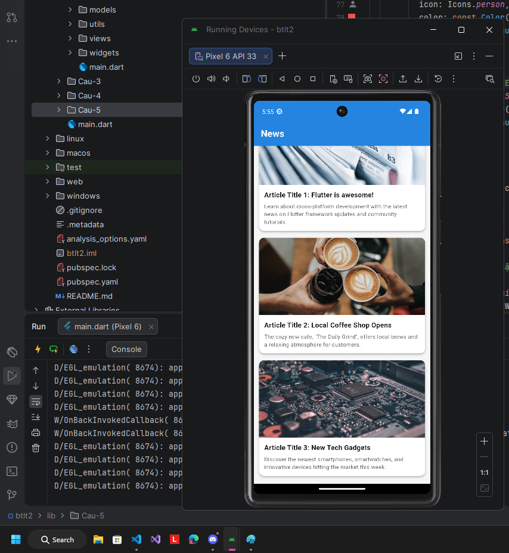
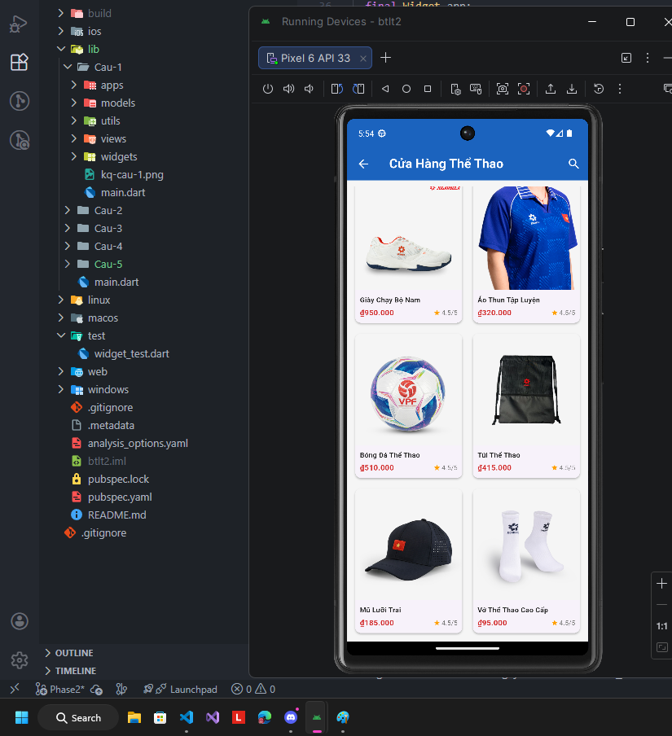
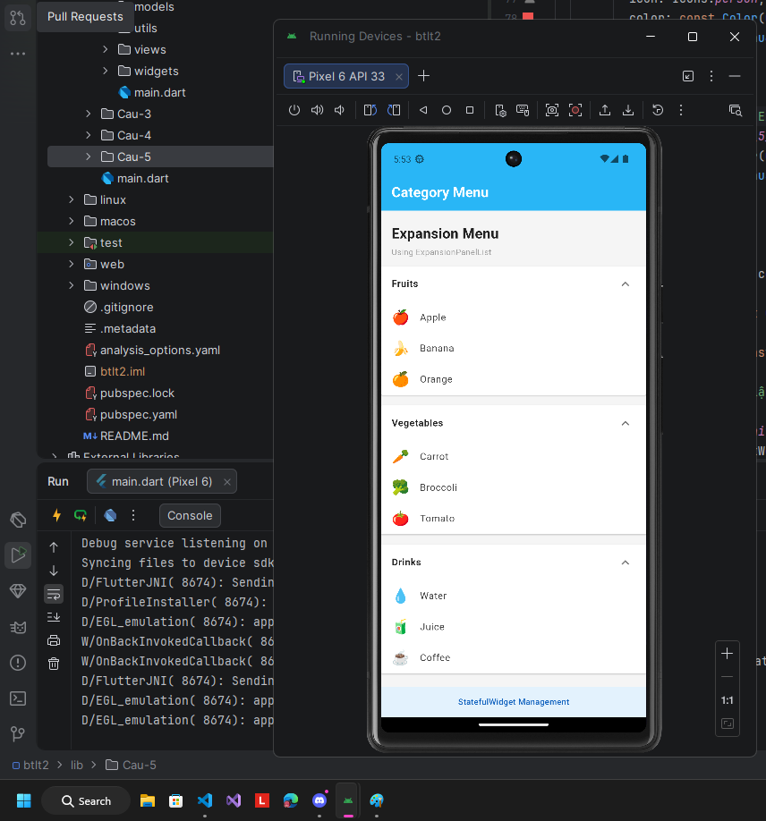

# BÀI TẬP LÝ THUYẾT 2 - FLUTTER

**Sinh viên:** Nguyễn Phạm Bảo Khanh
**MSSV:** 6451071033

---

## 📸 Kết quả thực hiện

### Câu 1: Profile Screen
Hiển thị giao diện thông tin cá nhân.

### Câu 2: Food List Screen 
Hiển thị danh sách các món ăn.

### Câu 3: News Screen
Hiển thị danh sách tin tức với hình ảnh và mô tả.

### Câu 4: Product Grid Screen
Hiển thị danh sách sản phẩm dưới dạng lưới.

### Câu 5: Expansion Menu Screen
Giao diện Menu với khả năng mở rộng.

---
